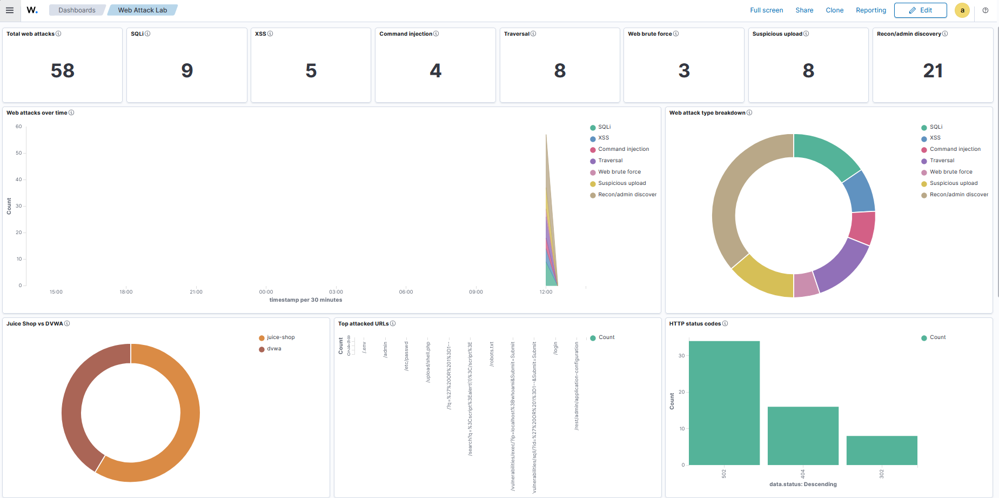
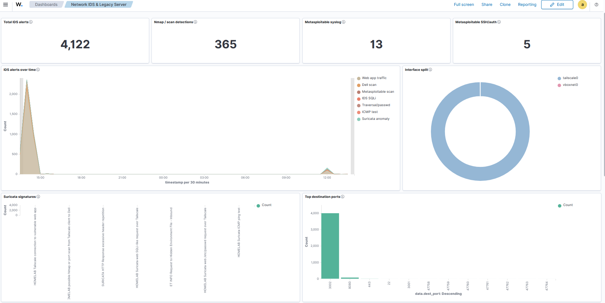
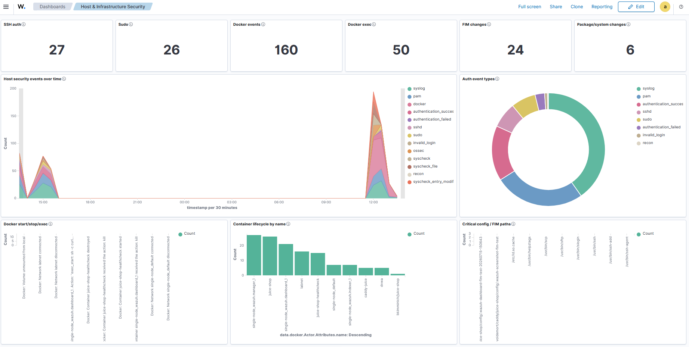

<h1 align="center">Cybersecurity Homelab with Wazuh, Suricata, DVWA, Juice Shop & Metasploitable</h1>

<p align="center">
  
</p>

<p align="center">
  <b>My personal cybersecurity homelab documentation: a private SOC-style lab built with Ubuntu Server, Docker, Wazuh SIEM, Suricata IDS, DVWA, Juice Shop, and Metasploitable.</b>
</p>

<p align="center">
  
  
  
  
  
  
  
</p>

## Cybersecurity Homelab Documentation

This repository documents my personal **cybersecurity homelab** from the ground up. It is written as my own build log, reference guide, configuration record, and detection notes for a private SOC-style lab.

The lab follows this workflow:

```text
Attack simulation -> vulnerable server/app -> logs and alerts -> Wazuh rules -> SIEM dashboard investigation
```

The goal was not just to install tools. I wanted a lab that felt closer to a small internal security environment, where I could safely practice:

- Wazuh SIEM setup and endpoint monitoring
- Suricata IDS network detection
- Docker-based vulnerable web apps
- DVWA and OWASP Juice Shop attack logging
- Metasploitable 2 legacy server monitoring
- Nmap scan detection
- web attack detection for SQL injection, XSS, traversal, command injection, brute-force-like behavior, suspicious uploads, and recon paths
- SOC-style dashboard design and alert investigation

The documentation is detailed enough for someone else to follow, but it is primarily the record of how this homelab is designed, configured, operated, and tested.

## What This Homelab Contains

| Layer | What I Documented |
|---|---|
| Server | Ubuntu Server 22.04.5 LTS on a dedicated homelab machine |
| Remote access | Tailscale private access for administration and testing |
| Firewall | UFW rules for Tailscale-only access and lab isolation |
| Containers | Docker network, DVWA, OWASP Juice Shop, and Caddy reverse proxy |
| Virtual machine | Metasploitable 2 in VirtualBox with host-only networking |
| SIEM | Wazuh manager, indexer, dashboard, and Ubuntu host agent |
| IDS | Suricata monitoring lab network interfaces |
| Logs | Ubuntu auth/syslog, Docker events, Caddy JSON logs, Metasploitable syslog, Suricata EVE alerts |
| Detection engineering | Custom Wazuh rules for web attacks and scan correlation |
| Dashboards | Four Wazuh dashboards for SOC overview, web attacks, IDS/legacy server, and host security |
| Operations | Start/stop playbooks, health checks, backups, log rotation, and detection tests |

## Who This May Help

This repo is my homelab documentation first, but it may also help anyone searching for:

- cybersecurity homelab guide
- beginner cybersecurity homelab
- Wazuh homelab tutorial
- Wazuh SIEM home lab
- SOC analyst home lab
- blue team homelab
- SIEM detection engineering lab
- Suricata Wazuh integration
- DVWA Wazuh logging
- Juice Shop attack detection
- Metasploitable monitoring
- step-by-step homelab setup

It is especially relevant if you want to see how a real personal lab can be organized without exposing vulnerable services to the public internet.

## Start Here

Begin with the roadmap:

[docs/index.md](./docs/index.md)

That page explains the order of the documentation, what each section covers, and what should be working before moving to the next phase.

## Guide Map

| Section | What It Covers |
|---|---|
| [Overview](./docs/00-overview/01-project-introduction.md) | Project goals, architecture, hardware, port map, and lab scope |
| [OS Installation](./docs/01-os-installation/01-ubuntu-server-choice.md) | Ubuntu Server install from bootable USB to first login |
| [Remote Access And Firewall](./docs/02-remote-access-and-firewall/01-tailscale-setup.md) | Tailscale, UFW, remote SSH, and Docker exposure strategy |
| [Docker Platform](./docs/03-docker-platform/01-why-docker.md) | Docker install, lab network, restart policies, troubleshooting |
| [Vulnerable Web Apps](./docs/04-vulnerable-web-apps/01-web-lab-overview.md) | DVWA, Juice Shop, Caddy reverse proxy, and web access logs |
| [Metasploitable](./docs/05-metasploitable/01-why-metasploitable.md) | VirtualBox VM, host-only network, Tailscale route, syslog forwarding |
| [Wazuh](./docs/06-wazuh/01-wazuh-overview.md) | Wazuh install, agent enrollment, log ingestion, FIM, vulnerability detection, Docker monitoring |
| [Suricata](./docs/07-suricata/01-why-suricata.md) | IDS install, interface monitoring, Suricata-to-Wazuh ingestion |
| [Detection Engineering](./docs/08-detection-engineering/01-detection-strategy.md) | Custom rules, scan detection, web detections, test results |
| [Dashboards](./docs/09-dashboards/01-dashboard-design.md) | Four final Wazuh dashboards and panel logic |
| [Operations](./docs/10-operations/01-start-lab.md) | Start/stop flow, health checks, backups, log rotation |
| [Attack Simulation](./docs/11-attack-simulation/01-testing-rules.md) | Safe Nmap, DVWA, Juice Shop, and Metasploitable tests |
| [Limitations And Lessons](./docs/12-limitations-and-lessons/01-hardware-limitations.md) | Hardware limits, Wazuh limits, detection gaps, lessons learned |
| [Playbooks](./docs/13-playbooks/01-start-wazuh.md) | Operational command notes for running the lab |

## Final Architecture

The lab is private by design:

- Tailscale is the remote access boundary.
- UFW limits access to trusted lab paths.
- Vulnerable services stay stopped unless testing.
- Docker apps are not exposed directly to the public internet.
- Metasploitable is isolated behind the homelab host-only VirtualBox network.
- Public documentation uses placeholders instead of real IP addresses, usernames, passwords, or secrets.

```text
attack_station
-> Tailscale
-> homelab
-> Docker vulnerable apps / VirtualBox Metasploitable
-> logs and alerts
-> Wazuh dashboards
```

## Detection Coverage

| Detection Area | Examples Covered |
|---|---|
| Host security | SSH success/failure, sudo activity, system logs, package/system changes |
| File Integrity Monitoring | important Wazuh, Caddy, rsyslog, logrotate, firewall, and network config paths |
| Docker monitoring | container start, stop, lifecycle, and Docker event visibility |
| Web attacks | SQLi-like requests, XSS-like requests, traversal, command injection, suspicious uploads, recon/admin discovery, web brute-force-like patterns |
| Network IDS | Nmap scans, port sweeps, Suricata signatures, destination ports, source/destination IPs |
| Legacy server | Metasploitable syslog, SSH/auth activity, scan evidence, service enumeration evidence |
| Vulnerability posture | Wazuh Vulnerability Detection and package inventory context |

## Wazuh Dashboards

The final dashboard setup is intentionally clean: four dashboards, each with a clear job.

| Dashboard | Purpose |
|---|---|
| Homelab SOC Overview | Central SIEM overview with total alerts, high severity alerts, MITRE context, source breakdowns, detection categories, and recent notable alerts |
| Web Attack Lab | DVWA and Juice Shop web attack investigation |
| Network IDS & Legacy Server | Suricata alerts, Nmap/scan detections, destination ports, interfaces, and Metasploitable evidence |
| Host & Infrastructure Security | SSH, sudo, Docker, FIM, package changes, and system activity |

Dashboard documentation:

[docs/09-dashboards/01-dashboard-design.md](./docs/09-dashboards/01-dashboard-design.md)

Sanitized Wazuh dashboard export:

```text
exports/wazuh-dashboards/wazuh-dashboards.ndjson
```

## Screenshots

| Dashboard | Preview |
|---|---|
| Homelab SOC Overview |  |
| Web Attack Lab |  |
| Network IDS & Legacy Server |  |
| Host & Infrastructure Security |  |

## Repository Layout

```text
.
├── archive/     # archived older documentation
├── assets/      # diagrams and screenshots used by the documentation
├── configs/     # sanitized config examples from the final lab
├── docs/        # full homelab documentation
├── exports/     # sanitized Wazuh dashboard export
├── scripts/     # Markdown command bundles for common operations
├── README.md
└── LICENSE
```

## Included Artifacts

| Folder | Contents |
|---|---|
| `archive/old-documentation/` | Sanitized archived PDF of the earlier homelab documentation |
| `assets/architecture/` | Architecture, network/port, log-ingestion, and attack-to-detection diagrams |
| `assets/dashboards/` | Final dashboard screenshots |
| `assets/screenshots/` | Supporting Wazuh, FIM, Suricata, and web-alert screenshots |
| `configs/` | Sanitized Docker, Wazuh, Suricata, rsyslog, and logrotate examples |
| `exports/wazuh-dashboards/` | Sanitized saved-object export for the four dashboards |
| `scripts/` | Start, stop, and health-check command bundles |

## Security Scope

This is a controlled educational lab.

- Only test systems you own or have permission to test.
- Do not expose DVWA, Juice Shop, Metasploitable, or Wazuh directly to the public internet.
- Keep vulnerable targets stopped unless actively testing.
- Replace all placeholders with your own private lab values.
- Never commit real passwords, IP addresses, private keys, API tokens, or session data.

## Design Note

This repository documents the final Wazuh-based version of my homelab. If you want to compare it with the earlier lightweight version built for hardware-constrained setups, see the archived PDF:

[Old Homelab Documentation](<./archive/old-documentation/Homelab Documentation.pdf>)

## Project Contents

This repo includes:

- complete documentation sections from OS installation through dashboards
- operations and playbook sections for starting, stopping, and checking the lab
- sanitized configuration examples
- sanitized Wazuh dashboard export
- architecture diagrams and dashboard screenshots
