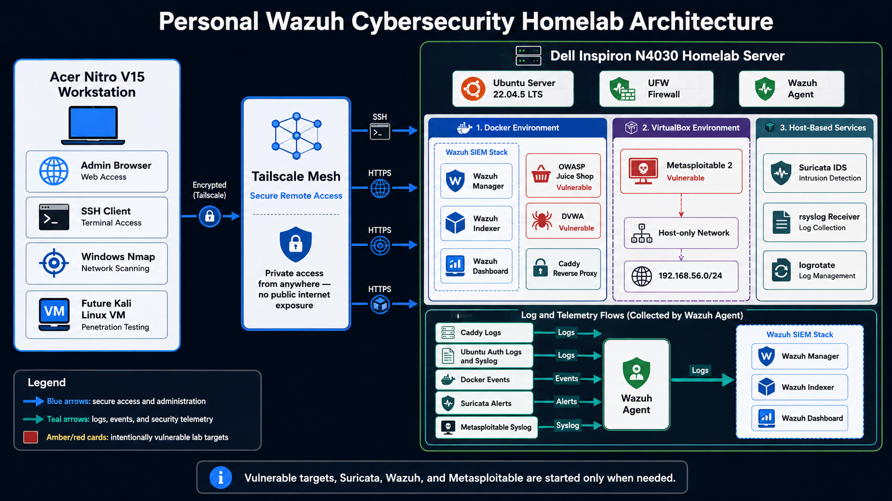

# Final Architecture

This is the final Wazuh-based architecture used for the homelab.

The design has three main layers:

1. Acer
2. Dell
3. the monitored targets and log sources

The important idea is that everything stays private. The lab is reached through Tailscale, not through public port forwarding.

## High-Level Architecture



```text
Acer Nitro V15
  Admin browser
  SSH client
  Nmap testing
  Future Kali VM
        |
        v
Tailscale private network
        |
        v
Dell Inspiron N4030 - Ubuntu Server 22.04.5 LTS
  SSH
  UFW
  Tailscale
  Wazuh Agent
  Suricata
  rsyslog
  logrotate
        |
        +-- Docker
        |     Wazuh Manager
        |     Wazuh Indexer
        |     Wazuh Dashboard
        |     Caddy Reverse Proxy
        |     OWASP Juice Shop
        |     DVWA
        |
        +-- VirtualBox
              Metasploitable 2
              Host-only network: <VBOXNET_SUBNET>
```

## Main Roles

| Component | Role |
|---|---|
| Acer Nitro V15 | Admin, analyst, documentation, and testing workstation |
| Tailscale | Private remote access layer |
| Dell Ubuntu Server | Main server and monitored host |
| Docker | Runs Wazuh and web lab services |
| Caddy | Provides logged access paths to Juice Shop and DVWA |
| Juice Shop | Modern vulnerable web application |
| DVWA | Classic vulnerable web application |
| VirtualBox | Runs Metasploitable 2 |
| Metasploitable 2 | Legacy vulnerable server |
| Wazuh Agent | Collects local logs, FIM events, Docker events, and vulnerability data |
| Wazuh Manager | Processes alerts and rules |
| Wazuh Indexer | Stores Wazuh data |
| Wazuh Dashboard | Displays detections and investigation panels |
| Suricata | Network IDS for scans and suspicious traffic |
| rsyslog | Receives Metasploitable syslog |

## Docker Layout

Docker is used for the services that benefit from being easy to start, stop, recreate, and isolate.

| Container | Purpose | Runtime Policy |
|---|---|---|
| `single-node_wazuh.manager_1` | Wazuh manager | manual start |
| `single-node_wazuh.indexer_1` | Wazuh indexer | manual start |
| `single-node_wazuh.dashboard_1` | Wazuh dashboard | manual start |
| `juice-shop` | vulnerable web app | stopped unless testing |
| `dvwa` | vulnerable web app | stopped unless testing |
| `caddy-juice` | logged reverse proxy for web targets | stopped unless testing |

The Wazuh containers also use manual start. This is not how a production SIEM should normally operate, but it is appropriate for this homelab because the Dell hardware is limited.

## VirtualBox Layout

Metasploitable 2 runs as a VirtualBox VM on the Dell.

| Item | Value |
|---|---|
| VM name | `metasploitable2` |
| Network type | VirtualBox host-only |
| Dell host-only interface | `vboxnet0` |
| Dell host-only IP | `<VBOXNET_HOST_IP>` |
| Metasploitable IP | `<METASPLOITABLE_IP>` |

This keeps Metasploitable away from the normal LAN while still allowing controlled access through the Dell.

## Remote Access Flow

The normal remote workflow is:

```text
Acer anywhere
-> Tailscale
-> Dell
-> SSH / Wazuh Dashboard / Caddy Juice Shop / DVWA
```

Metasploitable access uses a subnet route:

```text
Acer or future Kali VM
-> Tailscale
-> Dell subnet router
-> vboxnet0
-> Metasploitable <METASPLOITABLE_IP>
```

This lets the Acer reach Metasploitable without exposing Metasploitable directly to the home LAN or the public internet.

## Log And Detection Flow

Wazuh receives evidence from several places:

```text
Ubuntu auth/syslog
Docker events
Caddy Juice Shop access logs
Caddy DVWA access logs
Metasploitable forwarded syslog
Suricata EVE alerts
FIM and vulnerability data
        |
        v
Wazuh Agent on Dell
        |
        v
Wazuh Manager
        |
        v
Wazuh Indexer
        |
        v
Wazuh Dashboard
```

## Why Caddy Is In The Architecture

Juice Shop and DVWA are useful targets, but Wazuh needs reliable web request evidence.

Caddy solves that by acting as the logged path into both applications:

```text
Acer browser
-> Tailscale
-> Caddy
-> Juice Shop or DVWA
-> Caddy JSON access log
-> Wazuh Agent
```

This is cleaner than relying only on container output because Caddy produces structured JSON access logs that are easier to decode and detect against.

## Why Suricata Is In The Architecture

Caddy shows the HTTP request layer. Suricata shows the network layer.

For example:

- Caddy can show a suspicious URL requested from a browser
- Suricata can show Nmap/scan traffic or IDS signatures

Both are useful, but they answer different questions. The dashboards keep them separate enough to investigate clearly.

## Final Wazuh Dashboards

The final dashboard setup has four dashboards:

| Dashboard | Purpose |
|---|---|
| Homelab SOC Overview | Central view of alerts, severity, MITRE context, source breakdowns, and notable events |
| Web Attack Lab | DVWA and Juice Shop web attack investigation |
| Network IDS & Legacy Server | Suricata, scan activity, and Metasploitable evidence |
| Host & Infrastructure Security | SSH, sudo, Docker, FIM, package, and system activity |

This keeps the dashboard layout realistic without creating too many tiny dashboards.

## Default Runtime State

The final lab is quiet by default:

| Component | Default State |
|---|---|
| SSH | running |
| Tailscale | running |
| Wazuh | stopped unless needed |
| Suricata | stopped unless testing |
| Juice Shop | stopped unless testing |
| DVWA | stopped unless testing |
| Caddy web proxy | stopped unless testing |
| Metasploitable | powered off unless testing |

## Section Summary

The architecture keeps the lab private and readable: Tailscale handles remote access, Caddy creates clean web logs, Wazuh handles SIEM visibility, Suricata adds network IDS evidence, and Metasploitable stays isolated behind the VirtualBox host-only network.

## Next Step

Continue to:

[04 - Network And Port Map](./04-network-and-port-map.md)
