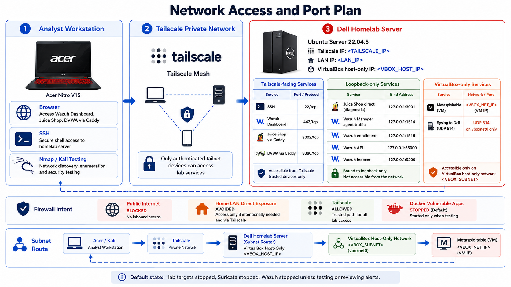

# Network And Port Map

This section documents how the homelab is reachable and which ports are intentionally exposed.

The main rule is simple:

> Use Tailscale for remote access. Do not expose vulnerable lab services to the public internet.

## Access Model



The normal access path is:

```text
Acer
-> Tailscale
-> Dell
```

The Dell has three important network areas:

| Network Area | Purpose |
|---|---|
| Tailscale interface | private remote access from the Acer |
| LAN interface | normal home network connectivity |
| `vboxnet0` | VirtualBox host-only network for Metasploitable |

In this design, lab services are intentionally planned around the Tailscale path.

## Tailscale-Facing Services

These are the services intended to be reachable from the Acer through Tailscale when they are running.

| Service | Port | Purpose |
|---|---:|---|
| SSH | `22/tcp` | manage the Dell |
| Wazuh Dashboard | `443/tcp` | open the Wazuh UI from the Acer |
| Juice Shop through Caddy | `3002/tcp` | logged Juice Shop testing path |
| DVWA through Caddy | `8080/tcp` | logged DVWA testing path |

Important:

- If Wazuh is stopped, port `443` should not answer.
- If the vulnerable web targets are stopped, ports `3002` and `8080` should not answer.
- SSH stays available because it is the admin path into the Dell.

## Docker Port Bindings

Docker port bindings are part of the security design. The firewall matters, but Docker-published ports also need to be bound carefully.

| Container | Binding | Why |
|---|---|---|
| `juice-shop` | `localhost:3001 -> 3000/tcp` | direct diagnostic access only from the Dell |
| `caddy-juice` | `<HOMELAB_TAILSCALE_IP>:3002 -> 3002/tcp` | logged Juice Shop path from the Acer |
| `caddy-juice` | `<HOMELAB_TAILSCALE_IP>:8080 -> 8080/tcp` | logged DVWA path from the Acer |
| `dvwa` | no host port | prevents bypassing Caddy logs |

The direct Juice Shop port exists only as a diagnostic path. Normal testing should use Caddy so the request is logged.

```text
Use this for detection testing:
Acer -> Tailscale -> Caddy -> Juice Shop

Do not use this for normal detection testing:
Acer -> direct Juice Shop port
```

## Wazuh Port Bindings

The Wazuh stack uses tighter bindings than a broad default deployment.

| Wazuh Component | Binding | Exposure |
|---|---|---|
| Wazuh Dashboard | `<HOMELAB_TAILSCALE_IP>:443 -> 5601/tcp` | reachable through Tailscale |
| Wazuh Manager agent traffic | `localhost:1514 -> 1514/tcp` | local homelab agent only |
| Wazuh Manager enrollment | `localhost:1515 -> 1515/tcp` | local enrollment only |
| Wazuh API | `localhost:55000 -> 55000/tcp` | local troubleshooting only |
| Wazuh Indexer | `localhost:9200 -> 9200/tcp` | local troubleshooting only |
| Wazuh syslog input | not published | Metasploitable logs are handled by homelab rsyslog |

This keeps the Wazuh dashboard available from the Acer while keeping the manager, API, and indexer local to the Dell.

## Metasploitable Network

Metasploitable is isolated on a VirtualBox host-only network.

| Item | Value |
|---|---|
| Dell host-only interface | `vboxnet0` |
| Dell host-only IP | `<VBOXNET_HOST_IP>` |
| Metasploitable IP | `<METASPLOITABLE_IP>` |
| Metasploitable subnet | `<VBOXNET_SUBNET>` |

The syslog flow is:

```text
Metasploitable <METASPLOITABLE_IP>
-> UDP 514
-> Dell vboxnet0 <VBOXNET_HOST_IP>
-> /var/log/metasploitable/metasploitable.log
-> Wazuh Agent
```

Remote testing from the Acer uses Tailscale subnet routing:

```text
Acer or Kali
-> Tailscale
-> Dell subnet router
-> <VBOXNET_SUBNET>
-> Metasploitable <METASPLOITABLE_IP>
```

## UFW Firewall Intent

UFW is used as a second layer of control.

| Purpose | Rule Intent |
|---|---|
| SSH admin | allow SSH on `tailscale0` |
| Wazuh dashboard | allow `443/tcp` on `tailscale0` |
| Juice Shop through Caddy | allow `3002/tcp` on `tailscale0` |
| DVWA through Caddy | allow `8080/tcp` on `tailscale0` |
| Metasploitable syslog | allow `514/udp` only on `vboxnet0` from `<METASPLOITABLE_IP>` |
| Metasploitable subnet routing | allow `tailscale0 <-> vboxnet0` forwarding only for the lab route |
| Default inbound | deny |
| Default outbound | allow |
| Default routed | deny except the explicit lab route |

The firewall should not be treated as the only protection. Docker bindings and runtime policy are also part of the design.

## Idle State Port Expectations

When the lab is fully stopped after a testing session, the expected outside view from the Acer is:

| Port | Expected State |
|---:|---|
| `22/tcp` | reachable |
| `443/tcp` | closed if Wazuh is stopped |
| `3001/tcp` | closed externally |
| `3002/tcp` | closed if web targets are stopped |
| `8080/tcp` | closed if web targets are stopped |
| `1514/tcp` | closed externally |
| `1515/tcp` | closed externally |
| `55000/tcp` | closed externally |
| `9200/tcp` | closed externally |

This is the desired quiet state.

## Section Summary

The port plan separates trusted access, diagnostic access, and local-only services. Tailscale-facing services are reachable only when intentionally running, Wazuh internal services stay local-only, and Metasploitable remains on the VirtualBox host-only network.

## Next Step

Continue to:

[05 - Security Scope And Rules](./05-security-scope-and-rules.md)
