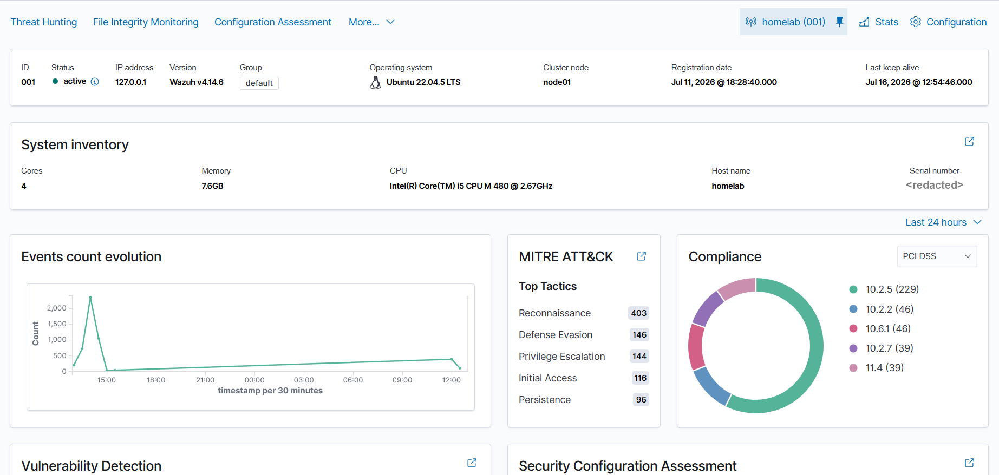

# Install Host Agent

The Wazuh agent runs directly on the homelab Ubuntu host. It should not be hidden inside a container because it needs direct access to host logs, package inventory, FIM paths, Docker events, and local files.

## Add The Wazuh Package Repository

Run on the homelab:

```bash
curl -s https://packages.wazuh.com/key/GPG-KEY-WAZUH | sudo gpg --dearmor -o /usr/share/keyrings/wazuh.gpg
sudo chmod 644 /usr/share/keyrings/wazuh.gpg
```

Command breakdown:

| Part | Meaning |
|---|---|
| `curl -s ...` | Downloads the Wazuh repository signing key quietly. |
| `|` | Sends the downloaded key directly into the next command. |
| `gpg --dearmor` | Converts the key into the binary format APT expects. |
| `-o /usr/share/keyrings/wazuh.gpg` | Saves the trusted key in a dedicated keyring file. |
| `chmod 644` | Lets APT read the key while keeping it non-executable. |

Create the repository file:

```bash
sudo nano /etc/apt/sources.list.d/wazuh.list
```

Add:

```text
deb [signed-by=/usr/share/keyrings/wazuh.gpg] https://packages.wazuh.com/4.x/apt/ stable main
```

Line breakdown:

| Part | Meaning |
|---|---|
| `signed-by=/usr/share/keyrings/wazuh.gpg` | Tells APT to trust this repository only when packages are signed by the Wazuh key. |
| `https://packages.wazuh.com/4.x/apt/` | Wazuh's APT package repository for version 4.x. |
| `stable main` | Uses Wazuh's stable package channel. |

Update package lists:

```bash
sudo apt update
```

## Install The Agent

Because the Wazuh manager is bound locally in this phase, use `localhost` as the manager address:

```bash
sudo WAZUH_MANAGER='localhost' WAZUH_AGENT_NAME='homelab' apt install -y wazuh-agent
```

Command breakdown:

| Part | Meaning |
|---|---|
| `WAZUH_MANAGER='localhost'` | Points the homelab agent to the manager running on the same host through Docker port binding. |
| `WAZUH_AGENT_NAME='homelab'` | Gives the endpoint a clean name inside Wazuh. |
| `apt install -y wazuh-agent` | Installs the Wazuh agent without stopping for a yes/no prompt. |

## Start The Agent

Run:

```bash
sudo systemctl daemon-reload
sudo systemctl enable --now wazuh-agent
sudo systemctl status wazuh-agent
```

## Verify From The Wazuh Manager

Run:

```bash
docker exec single-node_wazuh.manager_1 /var/ossec/bin/agent_control -l
```

Command breakdown:

| Part | Meaning |
|---|---|
| `docker exec` | Runs a command inside an already-running container. |
| `single-node_wazuh.manager_1` | Targets the Wazuh manager container. |
| `/var/ossec/bin/agent_control -l` | Lists Wazuh agents and their status. |

Expected result:

- an agent named `homelab` appears
- the agent status is `Active`

## Dashboard Check

From the attack_station, open:

```text
https://<HOMELAB_TAILSCALE_IP>/
```

Then check:

```text
Endpoints -> homelab
```



You should see the homelab listed as an active Ubuntu agent.

## Next Step

Continue to [Configure Log Ingestion](./06-configure-log-ingestion.md).
