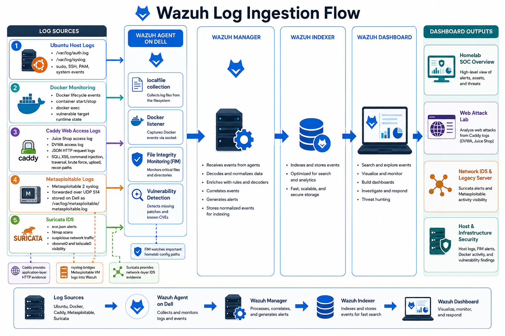

# Configure Log Ingestion

The homelab Wazuh agent collects local files and sends them to the Wazuh manager. This section configures the log sources that make the homelab useful for detection.



## Edit The Agent Config

Open:

```bash
sudo nano /var/ossec/etc/ossec.conf
```

After changes, restart the agent:

```bash
sudo systemctl restart wazuh-agent
```

Check the agent log:

```bash
sudo tail -n 80 /var/ossec/logs/ossec.log
```

## Ubuntu Auth And Syslog

Add or verify:

```xml
<localfile>
  <log_format>syslog</log_format>
  <location>/var/log/auth.log</location>
</localfile>

<localfile>
  <log_format>syslog</log_format>
  <location>/var/log/syslog</location>
</localfile>
```

These logs provide:

- SSH successes and failures
- invalid users
- PAM activity
- sudo activity
- system service messages

## Caddy JSON Logs

Caddy is the logged front door for Juice Shop and DVWA.

Add:

```xml
<localfile>
  <log_format>json</log_format>
  <location>/var/log/homelab/caddy-juice/juice-shop-access.log</location>
  <label key="homelab.source">caddy</label>
  <label key="homelab.app">juice-shop</label>
  <label key="homelab.log_type">caddy_access</label>
</localfile>

<localfile>
  <log_format>json</log_format>
  <location>/var/log/homelab/caddy-juice/dvwa-access.log</location>
  <label key="homelab.source">caddy</label>
  <label key="homelab.app">dvwa</label>
  <label key="homelab.log_type">caddy_access</label>
</localfile>
```

These logs support web attack rules for:

- SQL injection-like requests
- XSS-like requests
- command injection-like requests
- traversal attempts
- suspicious uploads
- recon/admin discovery
- web brute-force-like patterns

## Metasploitable Syslog

Metasploitable forwards syslog to the homelab, and the homelab writes it to one file.

Add:

```xml
<localfile>
  <log_format>syslog</log_format>
  <location>/var/log/metasploitable/metasploitable.log</location>
  <label key="homelab.source">metasploitable</label>
  <label key="homelab.log_type">forwarded_syslog</label>
</localfile>
```

This supports:

- Metasploitable service logs
- failed SSH attempts
- successful SSH sessions when logged
- legacy server evidence in Wazuh

## Verify Collection

Run:

```bash
sudo systemctl restart wazuh-agent
sudo tail -n 120 /var/ossec/logs/ossec.log
```

Look for messages showing that `wazuh-logcollector` is analyzing the configured files.

You can also generate a harmless syslog marker:

```bash
logger "wazuh syslog ingestion test"
```

Then search in Wazuh Dashboard for recent syslog/auth activity from the `homelab` agent.

## Next Step

Continue to [File Integrity Monitoring](./07-file-integrity-monitoring.md).
