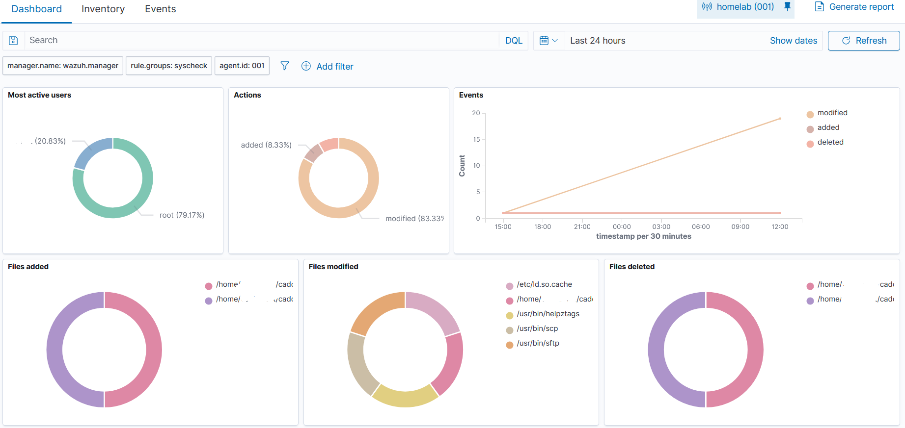

# File Integrity Monitoring

Wazuh File Integrity Monitoring watches important files and directories for changes. The goal is not to monitor everything. The goal is to watch meaningful configuration paths without creating noise or exposing secrets in diffs.



## Design

Keep Wazuh's default Linux scheduled monitoring and add real-time monitoring for small, high-value homelab paths.

Good FIM targets:

| Path | Why It Matters |
|---|---|
| `/home/<HOMELAB_USER>/caddy/juice-shop/config` | Caddy reverse proxy config for Juice Shop and DVWA |
| `/home/<HOMELAB_USER>/wazuh-docker/single-node` | Wazuh Docker stack entry point |
| `/home/<HOMELAB_USER>/wazuh-docker/single-node/config/wazuh_dashboard` | Wazuh dashboard config |
| `/home/<HOMELAB_USER>/wazuh-docker/single-node/config/wazuh_indexer` | Wazuh indexer security/config files |
| `/etc/rsyslog.d` | Metasploitable syslog receiver config |
| `/etc/logrotate.d` | Log rotation configs |
| `/etc/netplan` | Network configuration |
| `/etc/ufw` | Firewall configuration |

Do not monitor:

- the entire home directory
- Docker overlay storage
- high-volume log directories
- Wazuh backup folders full of old config snapshots

## Edit Wazuh Agent Config

Open:

```bash
sudo nano /var/ossec/etc/ossec.conf
```

Inside the `<syscheck>` section, add real-time paths:

```xml
<directories realtime="yes">/home/<HOMELAB_USER>/caddy/juice-shop/config</directories>
<directories realtime="yes">/home/<HOMELAB_USER>/wazuh-docker/single-node</directories>
<directories realtime="yes">/home/<HOMELAB_USER>/wazuh-docker/single-node/config/wazuh_dashboard</directories>
<directories realtime="yes">/home/<HOMELAB_USER>/wazuh-docker/single-node/config/wazuh_indexer</directories>
<directories realtime="yes">/etc/rsyslog.d</directories>
<directories realtime="yes">/etc/logrotate.d</directories>
<directories realtime="yes">/etc/netplan</directories>
<directories realtime="yes">/etc/ufw</directories>
```

`realtime="yes"` is used only on directories here. Wazuh's real-time FIM mode watches directories and their contents; it should not be written as real-time monitoring for one individual file.

Ignore backup noise:

```xml
<ignore>/home/<HOMELAB_USER>/wazuh-docker/single-node/backups</ignore>
```

Protect sensitive diffs:

```xml
<nodiff>/home/<HOMELAB_USER>/wazuh-docker/single-node/docker-compose.yml</nodiff>
<nodiff>/home/<HOMELAB_USER>/wazuh-docker/single-node/config/wazuh_dashboard/wazuh.yml</nodiff>
<nodiff>/home/<HOMELAB_USER>/wazuh-docker/single-node/config/wazuh_indexer/internal_users.yml</nodiff>
```

`nodiff` means Wazuh can alert that the file changed without storing or showing sensitive file content differences.

## Restart And Test

Run:

```bash
sudo systemctl restart wazuh-agent
```

Create, modify, and delete a harmless test file:

```bash
FIM_TEST="/home/<HOMELAB_USER>/caddy/juice-shop/config/.wazuh-fim-test"
date -Is > "$FIM_TEST"
printf 'modified %s\n' "$(date -Is)" >> "$FIM_TEST"
rm -f "$FIM_TEST"
```

Expected Wazuh results:

| Event | Meaning |
|---|---|
| File added | Wazuh saw the test file created |
| File modified | Wazuh saw the file content change |
| File deleted | Wazuh saw the file removed |

## Next Step

Continue to [Vulnerability Detection](./08-vulnerability-detection.md).
