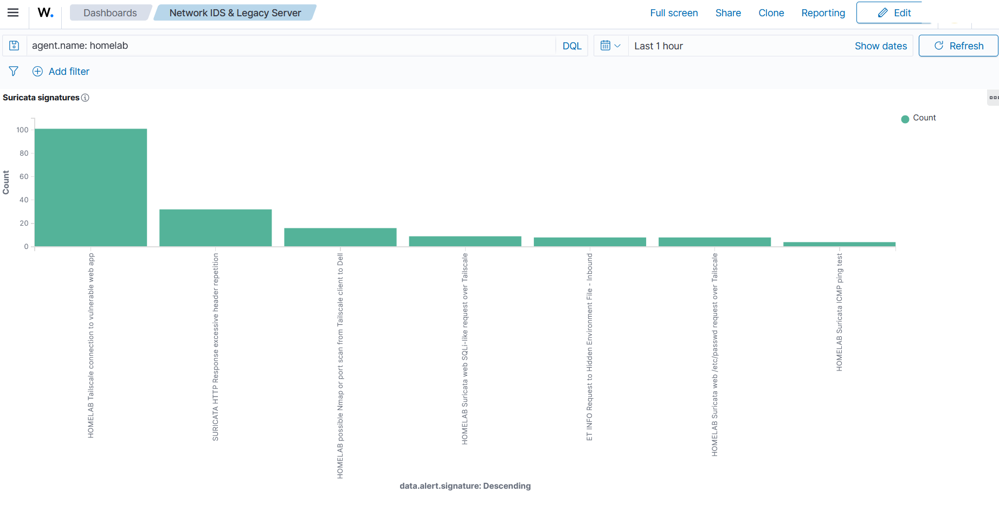

# Send Suricata Alerts To Wazuh

Suricata writes structured events to:

```text
/var/log/suricata/eve.json
```

Wazuh can read that file through the homelab Wazuh agent as JSON. This is the cleanest path for the current lab because Suricata and the Wazuh agent both run on `homelab`.



## Back Up The Agent Config

Run:

```bash
STAMP=$(date +%Y%m%d-%H%M%S)
BACKUP_DIR="/home/<HOMELAB_USER>/homelab-change-backups/wazuh-suricata-$STAMP"
mkdir -p "$BACKUP_DIR"
sudo cp /var/ossec/etc/ossec.conf "$BACKUP_DIR/ossec.conf.before"
```

This gives you a rollback point before editing Wazuh agent ingestion.

## Add The Suricata localfile Block

Open the Wazuh agent config:

```bash
sudo nano /var/ossec/etc/ossec.conf
```

Inside the main `<ossec_config>` block, add:

```xml
<!-- HOMELAB SURICATA IDS START -->
<localfile>
  <log_format>json</log_format>
  <location>/var/log/suricata/eve.json</location>
  <label key="homelab.source">suricata</label>
  <label key="homelab.log_type">network_ids</label>
</localfile>
<!-- HOMELAB SURICATA IDS END -->
```

Config breakdown:

| Line | Meaning |
|---|---|
| `<log_format>json</log_format>` | Tells Wazuh to parse each EVE line as JSON. |
| `<location>/var/log/suricata/eve.json</location>` | Points Wazuh at Suricata's EVE output file. |
| `<label key="homelab.source">suricata</label>` | Adds a source label for dashboard filtering. |
| `<label key="homelab.log_type">network_ids</label>` | Adds a log-type label for separating IDS data. |

Wazuh stores those labels under `data.homelab.*` in indexed alerts.

## Restart The Wazuh Agent

Run:

```bash
sudo systemctl restart wazuh-agent
sudo systemctl status --no-pager wazuh-agent
```

## Verify Logcollector Reads eve.json

Run:

```bash
sudo grep -i 'suricata/eve.json' /var/ossec/logs/ossec.log
```

Expected result:

```text
Analyzing file: '/var/log/suricata/eve.json'
```

The exact surrounding text can vary, but Wazuh should clearly show that it is reading the Suricata EVE file.

## Generate A Test Alert

Start Suricata:

```bash
sudo systemctl start suricata
```

Generate controlled lab traffic, such as:

```bash
ping <METASPLOITABLE_IP>
```

Then check Suricata locally:

```bash
sudo tail -f /var/log/suricata/eve.json | jq 'select(.event_type=="alert")'
```

## Verify In Wazuh

In Wazuh Threat Hunting, search:

```text
rule.groups:suricata
```

Useful fields to confirm:

| Field | Meaning |
|---|---|
| `rule.id` | Wazuh rule that matched the Suricata alert. |
| `rule.groups` | Should include `suricata` / `ids`. |
| `data.alert.signature` | Suricata signature name. |
| `data.alert.signature_id` | Suricata SID. |
| `data.src_ip` | Network source IP. |
| `data.dest_ip` | Network destination IP. |
| `data.dest_port` | Destination port. |
| `data.in_iface` | Interface that saw the traffic. |
| `data.homelab.source` | Should be `suricata`. |

## Expected Wazuh Rule

Suricata alerts normally appear through Wazuh's built-in Suricata rule handling. In this lab, Suricata alerts were visible under Wazuh Suricata/IDS groups and then used by custom dashboard panels and correlation rules.

Do not worry if the first test only shows a small number of alerts. Suricata is signature-based: it alerts when traffic matches enabled rules.

## Stop After Testing

Run:

```bash
sudo systemctl stop suricata
```

## Next Step

Continue to [Custom Suricata Rules](./06-custom-suricata-rules.md).
