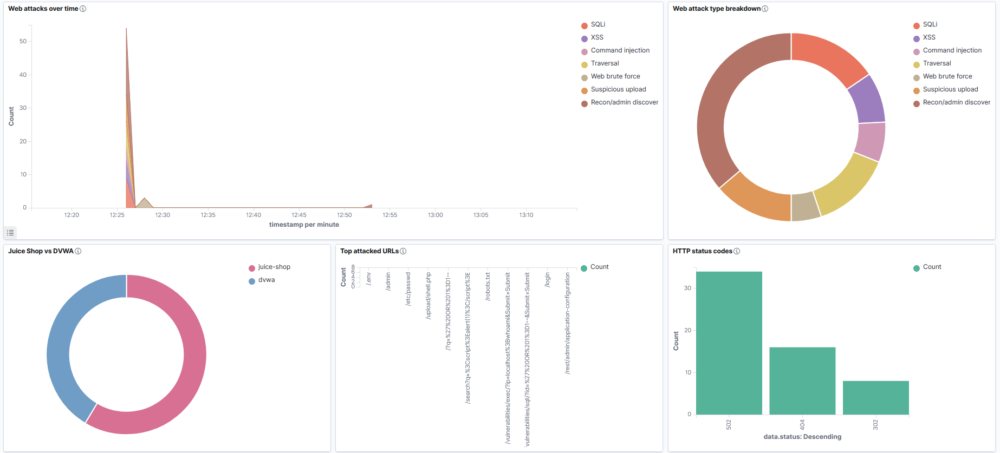

# Web Attack Rules

The web attack rules detect suspicious requests against Juice Shop and DVWA through Caddy JSON access logs.

The important point is that these rules are based on request logic, not on a hardcoded attacker IP. Any source that sends a matching request through the logged Caddy path can trigger the rule.



## Log Source

Caddy writes JSON access logs for the vulnerable web apps.

| App | Log Source | Wazuh Label |
|---|---|---|
| Juice Shop | Caddy JSON access log | `data.homelab.app:juice-shop` |
| DVWA | Caddy JSON access log | `data.homelab.app:dvwa` |

The Wazuh rules match decoded Caddy fields before indexing. In the dashboard, those fields appear under `data.*`, such as:

```text
data.request.uri
data.request.client_ip
data.status
data.homelab.app
```

## Final Web Rule Set

| Rule ID | Detection | Logic |
|---:|---|---|
| `110100` | General Caddy access log | Base Caddy web event. |
| `110101` | SQLi-like request | SQL keywords or encoded SQLi markers in URI. |
| `110102` | Path traversal-like request | Traversal or sensitive file markers in URI. |
| `110103` | XSS-like request | Script, event-handler, or JavaScript-style markers in URI. |
| `110104` | Command injection-like request | DVWA command injection path plus shell metacharacters or command keywords. |
| `110105` | Recon/admin path discovery | Admin, robots, environment/config, server-status, backup, or discovery paths. |
| `110106` | Suspicious upload/dangerous file request | Upload-related paths with script/executable-style extensions. |
| `110107` | Login/brute-force candidate | Login and brute-force paths. |
| `110108` | Possible web brute force | Repeated `110107` events from the same client in a short time window. |

## Rule Logic

The final rules are intentionally simple and readable.

| Detection | Example Pattern Category |
|---|---|
| SQLi | quote markers, `union`, `select`, SQL comments, boolean-style payloads |
| XSS | `<script>`, encoded script tags, event-handler strings, `javascript:` style strings |
| Command injection | DVWA exec path with shell separators or command keywords |
| Traversal | encoded traversal and sensitive path strings |
| Recon/admin | `robots.txt`, `admin`, `.env`, `phpmyadmin`, `server-status`, backup/config paths |
| Upload | upload paths with `.php`, `.jsp`, `.asp`, shell-like file names |
| Brute force | repeated login or brute-force endpoint requests |

These are not meant to be perfect production WAF rules. They are lab SIEM detections designed to show common attack behavior clearly.

## Frequency Rule

`110108` is the web brute-force rule.

It depends on `110107`.

```text
login/brute-force candidate event
-> repeated from same request.client_ip
-> threshold reached
-> possible web brute force alert
```

The implemented threshold:

| Setting | Value |
|---|---:|
| Base rule | `110107` |
| Count | `8` events |
| Window | `120` seconds |
| Same field | `request.client_ip` |

Why:

- one login request is normal
- repeated login-style requests from one client are more suspicious
- tracking by client IP makes the rule behave more like a real SIEM correlation

## Example Sanitized Rule Shape

The public example is shortened to show the structure, not every private pattern:

```xml
<group name="homelab,web,attack,">
  <rule id="110103" level="8">
    <if_sid>110100</if_sid>
    <field name="request.uri" type="pcre2">(?i)(script|%3cscript|onerror|onload|javascript:)</field>
    <description>Homelab Caddy XSS-like request</description>
    <mitre>
      <id>T1190</id>
    </mitre>
  </rule>

  <rule id="110108" level="10" frequency="8" timeframe="120">
    <if_matched_sid>110107</if_matched_sid>
    <same_field>request.client_ip</same_field>
    <description>Homelab possible web brute force from same source</description>
    <mitre>
      <id>T1110</id>
    </mitre>
  </rule>
</group>
```

Rule breakdown:

| Part | Meaning |
|---|---|
| `<if_sid>110100</if_sid>` | Only evaluate this rule after the base Caddy access rule matches. |
| `<field name="request.uri">` | Match against the decoded request URI. |
| `type="pcre2"` | Uses PCRE2 regex syntax for flexible matching. |
| `frequency="8" timeframe="120"` | Requires 8 matching events in 120 seconds. |
| `<if_matched_sid>110107</if_matched_sid>` | Counts previous login/brute-force candidate events. |
| `<same_field>request.client_ip</same_field>` | Requires the same source client field for correlation. |

## Test Requests

Use these only inside your own lab.

| Test | Expected Rule |
|---|---:|
| XSS-like search payload | `110103` |
| DVWA command injection-style URI | `110104` |
| `robots.txt` or admin path | `110105` |
| suspicious upload filename | `110106` |
| repeated login/brute-force requests | `110108` |

Example placeholders:

```text
http://<HOMELAB_TAILSCALE_IP>:3002/search?q=<XSS_TEST_PAYLOAD>
http://<HOMELAB_TAILSCALE_IP>:8080/vulnerabilities/exec/?ip=<COMMAND_TEST_PAYLOAD>&Submit=Submit
http://<HOMELAB_TAILSCALE_IP>:3002/robots.txt
http://<HOMELAB_TAILSCALE_IP>:8080/vulnerabilities/upload/<TEST_SCRIPT_NAME>
```

## Dashboard Fields

The Web Attack Lab dashboard uses:

| Field | Use |
|---|---|
| `rule.id` | Count by detection rule. |
| `rule.description` | Human-readable chart legend. |
| `data.request.uri` | Top attacked URLs. |
| `data.request.client_ip` | Top web source IPs. |
| `data.homelab.app` | Juice Shop vs DVWA split. |
| `data.status` | HTTP status codes. |

## Next Step

Continue to [Scan Detection Rules](./03-scan-detection-rules.md).
