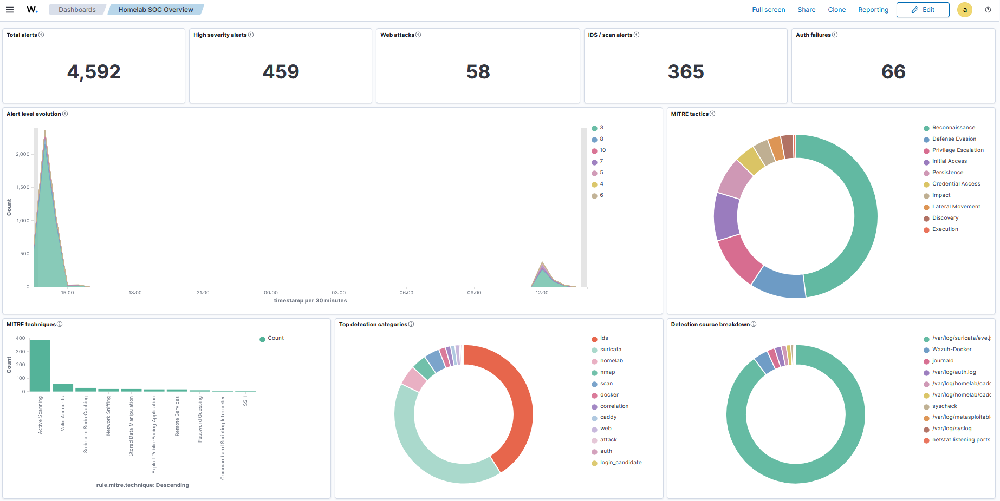

# Homelab SOC Overview

The Homelab SOC Overview dashboard is the first dashboard to open after logging in.

It answers:

```text
Is the SIEM seeing security activity across the lab?
```

It is not meant to replace detailed investigation dashboards. It is the central overview.



## Dashboard Purpose

| Purpose | Explanation |
|---|---|
| Executive-style overview | Show total alert volume, high severity, attack categories, and notable events. |
| SOC triage start point | Help decide whether to investigate web, IDS, or host activity next. |
| Detection health check | Confirm that Wazuh, Caddy, Suricata, Docker, and host logs are producing data. |

## Panel Layout

| Section | Panels |
|---|---|
| KPI row | Total alerts, high severity alerts, web attacks, IDS/scan alerts, auth failures |
| Main charts | Alert level evolution, MITRE tactics, MITRE techniques, top detection categories |
| Source/target charts | Detection source breakdown, top source IPs, top targeted web apps/services, top targeted ports |
| Bottom table | Recent notable security alerts |

## Main Detection Categories

| Category | Example Rules/Fields |
|---|---|
| Web attacks | `110101` to `110108` |
| Network IDS / scans | `86601`, `110120`, `110121`, `110122` |
| Authentication | SSH/PAM/authentication rule groups |
| Docker | `87903`, `87904`, `87907`, `87924` |
| FIM | `550`, `553`, `554`, `syscheck.path` |
| Sudo/admin | sudo rule groups |

## MITRE Panels

MITRE is kept on this dashboard because it gives a familiar SOC-style view.

Useful examples:

| Tactic/Technique | How It Appears |
|---|---|
| Initial Access / Exploit Public-Facing Application | Web attack rules such as SQLi, XSS, command injection, suspicious upload |
| Credential Access / Brute Force | Web brute-force correlation |
| Reconnaissance / Active Scanning | Nmap/scan correlation |
| Execution | Command injection-like request |

The MITRE panels are high-level summaries. Use the detailed dashboards to inspect the raw evidence.

## Important Fields

| Panel Type | Fields |
|---|---|
| Alert totals | `rule.level`, `rule.id` |
| Detection category | `rule.groups`, `rule.description` |
| Source breakdown | `data.homelab.source`, `rule.groups`, `location` |
| Source IPs | `data.request.client_ip`, `data.src_ip`, `data.srcip` |
| Targets | `data.homelab.app`, `data.dest_ip`, `data.dest_port` |
| MITRE | `rule.mitre.tactic`, `rule.mitre.technique` |
| Recent notable alerts | `timestamp`, `rule.description`, `rule.level`, `rule.id` |

## How To Use It

Start here:

1. Check high severity alerts.
2. Look at detection categories.
3. Check whether web attacks or IDS alerts increased.
4. Look at MITRE tactics and techniques.
5. Open the raw notable alert table.
6. Move to the matching detail dashboard.

Example:

```text
IDS/scan alerts increase
-> open Network IDS & Legacy Server
-> inspect source IPs, destination ports, and raw IDS logs
```

## What Not To Put Here

Do not overload the SOC overview with:

- full vulnerability inventory
- every raw web log
- every Docker event
- huge tables that belong in detail dashboards

The overview should stay fast to read.

## Next Step

Continue to [Web Attack Lab](./03-web-attack-lab.md).
