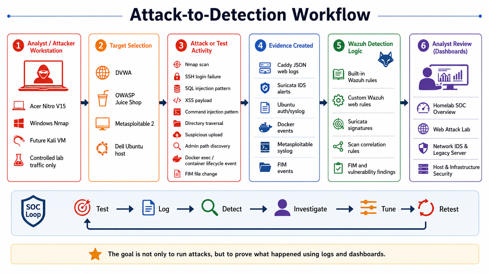

# Reading The Alerts

Dashboards are the starting point, not the final answer.

When an alert appears, move from summary to evidence.



## Investigation Flow

Use this flow:

```text
dashboard counter or chart
-> click/filter
-> raw event table
-> source log field
-> rule description and rule ID
-> conclusion
```

## Questions To Ask

For each alert, answer:

| Question | Why |
|---|---|
| What rule fired? | Identifies the detection logic. |
| What was the source? | Shows where the event came from. |
| What was the target? | Shows what was being tested. |
| What raw field proves it? | Prevents guessing from a chart alone. |
| Is it built-in or custom? | Helps explain Wazuh vs lab-specific rules. |
| Was this expected from my test? | Separates controlled testing from surprises. |

## Useful Fields

| Field | Meaning |
|---|---|
| `timestamp` | When Wazuh indexed the alert |
| `agent.name` | Monitored endpoint |
| `rule.id` | Wazuh rule ID |
| `rule.description` | Human-readable rule name |
| `rule.level` | Alert severity |
| `rule.groups` | Rule category |
| `data.homelab.app` | Lab app label, such as DVWA or Juice Shop |
| `data.request.uri` | Web request URI from Caddy |
| `data.alert.signature` | Suricata signature |
| `data.src_ip` | Network source IP |
| `data.dest_ip` | Network destination IP |
| `syscheck.path` | FIM file path |

## Example: Web Attack

If the Web Attack Lab dashboard shows SQLi:

1. Open the raw web logs table.
2. Find the newest SQLi-like event.
3. Confirm `rule.id`.
4. Confirm `data.homelab.app`.
5. Confirm `data.request.uri`.
6. Decide whether the test matched the expected result.

## Example: Network Scan

If the Network IDS & Legacy Server dashboard shows scan detections:

1. Open the raw IDS table.
2. Confirm `data.alert.signature`.
3. Confirm source and destination fields.
4. Confirm destination ports.
5. Check whether Wazuh correlation rule `110121` fired.

## Example: FIM Change

If Host & Infrastructure Security shows a FIM event:

1. Open raw infrastructure logs.
2. Confirm `syscheck.path`.
3. Confirm action: added, modified, or deleted.
4. Confirm whether the file is expected for the lab session.

## Write Honest Results

Use these result labels:

| Result | Meaning |
|---|---|
| Worked | Expected log and Wazuh alert appeared. |
| Partial | Some evidence appeared, but not the full intended detection. |
| Not detected | The test did not produce useful Wazuh evidence. |
| Deferred | The test was intentionally not run yet. |

Do not call something detected just because a generic log exists. A useful SIEM result needs a clear event, source, and explanation.

## Next Step

Continue to [Limitations And Lessons](../12-limitations-and-lessons/01-hardware-limitations.md).
